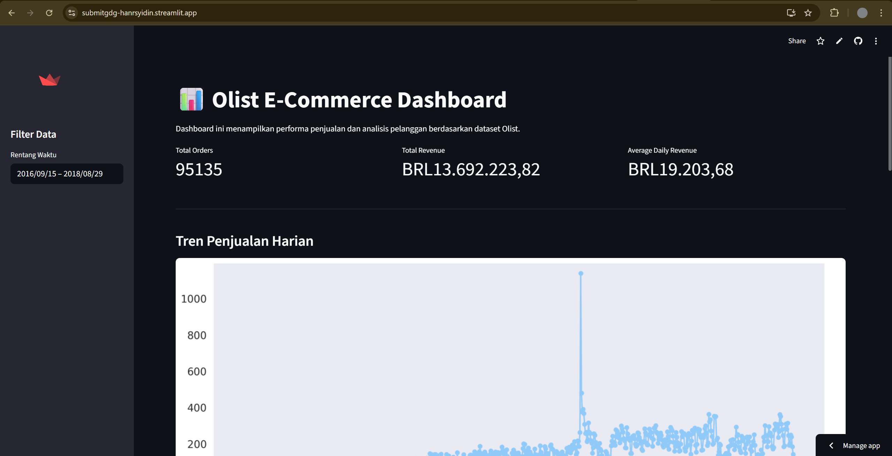
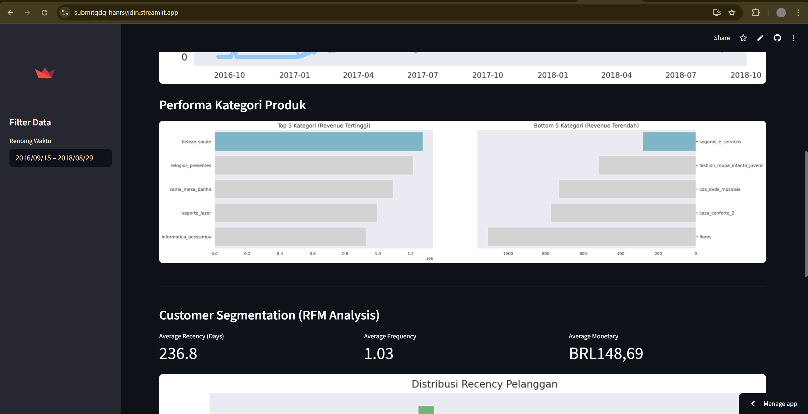
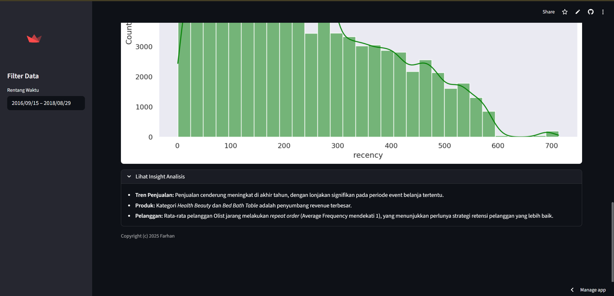

# Olist E-Commerce Dashboard 📊

## 📌 Deskripsi Proyek
Proyek ini adalah sebuah dashboard interaktif untuk menganalisis performa penjualan dan perilaku pelanggan pada e-commerce **Olist**. Dashboard ini dibuat menggunakan **Streamlit** dan menyajikan visualisasi data yang mendalam mengenai tren penjualan, performa produk, serta segmentasi pelanggan menggunakan analisis RFM (Recency, Frequency, Monetary).

Proyek ini berfokus pada Analisis Data & Dashboard (Business Intelligence), bukan berfokus pada Machine Learning (Predictive Model), walaupun dari code yang disubmit oleh community ada yang membuat model NLP dan Sales Forecasting. Namun kedua ranah tersebut masih saya pelajari dan tidak ingin mengacau pada submission ini. Alasan saya memilih Analisis Data & Dashboard (Business Intelligence) karena setidaknya *dalam hierarki kebutuhan data di perusahaan nyata, mengetahui apa yang terjadi (Descriptive) jauh lebih prioritas daripada menebak apa yang akan terjadi (Predictive).*

## 📂 Dataset
Dataset yang digunakan dalam proyek ini adalah **Brazilian E-Commerce Public Dataset by Olist**.
File dataset disimpan dalam folder `data/` yang mencakup:
- `olist_orders_dataset.csv`
- `olist_order_items_dataset.csv`
- `olist_products_dataset.csv`
- `olist_order_payments_dataset.csv`
- `olist_order_reviews_dataset.csv`
- `olist_customers_dataset.csv`

## 🚀 Cara Menjalankan Project

### 1. Setup Lingkungan
Pastikan Anda telah menginstal Python. Sangat disarankan untuk menggunakan virtual environment (seperti Anaconda atau venv).

Install semua library yang dibutuhkan dengan perintah berikut:
```bash
pip install -r requirements.txt
```

### 2. Menjalankan Dashboard
Jalankan perintah berikut di terminal untuk membuka dashboard Streamlit:
```bash
streamlit run dashboard.py
```
Dashboard akan otomatis terbuka di browser Anda (biasanya di `http://localhost:8501`).

### 3. Menjalankan Notebook (Opsional)
Jika ingin melihat proses eksplorasi data (EDA) dan analisis mendalam, Anda dapat membuka file notebook:
```bash
jupyter notebook notebook.ipynb
```

## 💡 Ringkasan Insight Analisis
Berikut adalah beberapa temuan utama dari analisis data:

1.  **Tren Penjualan**:
    - Penjualan cenderung mengalami peningkatan signifikan menjelang akhir tahun.
    - Terjadi lonjakan transaksi pada periode event belanja tertentu (misalnya Black Friday).

2.  **Performa Produk**:
    - Kategori **Health Beauty** dan **Bed Bath Table** merupakan penyumbang pendapatan terbesar.
    - Beberapa kategori memiliki performa rendah dan perlu strategi promosi lebih lanjut.

3.  **Perilaku Pelanggan (RFM)**:
    - Mayoritas pelanggan jarang melakukan pembelian ulang (*repeat order*), ditunjukkan dengan nilai **Frequency** rata-rata yang mendekati 1.
    - Hal ini mengindikasikan bahwa Olist perlu meningkatkan strategi retensi pelanggan untuk mendorong loyalitas.

## 📸 Tampilan Dashboard




---
**Copyright © 2025 Farhan**
